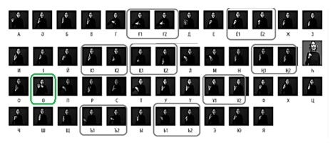
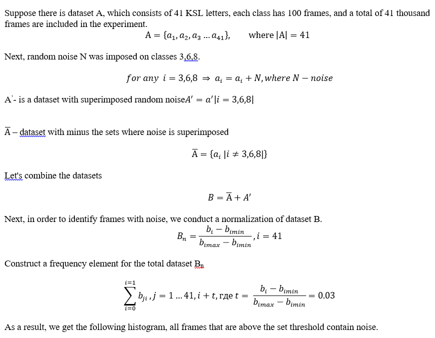
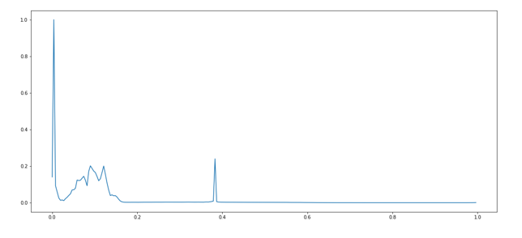
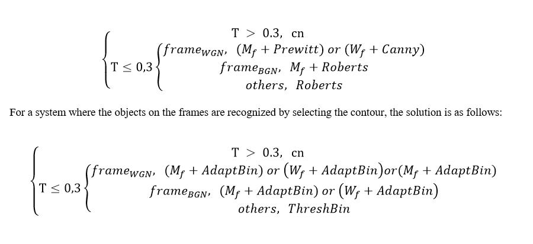

# img_preprocessing
## Getting Started
### Noise Detection
<p>
SL recognition is a classification task, hence, the data should be divided so that in the resulting sets, the numerical ratio of objects of different classes is the same as in the original population. Such a sample, called a dataset, is needed to train the Machine Learning model to train the system and then use it to solve real-world problems.  The experiment used the dataset alphabet KSL, which consists of 42 letters (figure), which was prepared by 41 classes of datasets (formula), some of them were artificially imposed random noise.

</p>
<p>  </p>
<p>  </p>

The proposed method of noise detection allows you to pre-check the presence of noise in the frames when creating a video recording, for real-time gesture recognition systems or detection of noise frames in the finished datasets, which ultimately can ensure the successful operation of any object recognition systems.

### Combined-adaptive image pre-processing method

Modern computer technology allows to carry out the automated analysis of various images. This requires, as a rule, the use of methods and algorithms of image preprocessing, their segmentation to select objects on them, and further study of these objects or their identification. However, most of the algorithms used for this require manual image preprocessing. This paper proposes an adapted method of image preprocessing that will use for filtering those or other filters depending on the noise in the input image and depending on the method of object recognition in the image.
Further, to eliminate noise detected frames for systems where objects on the frames are recognized on the basis of segmentation or extraction of the value proposed the following solution: 
<p>  </p>

Thus, the proposed algorithm of image preprocessing for the selection of objects on it does not assume the presence of a priori knowledge about the image, which makes the algorithm universal. This algorithm can be used in research aimed at developing gesture recognition systems for adaptive preprocessing. 


## Installation
### Window Python Installation Guide

1. Downlaod the [Python 3.7.0](https://www.python.org/ftp/python/3.7.0/python-3.7.0.exe) from the official website.

	**Remember to check the `Add Python to path` option as shown below**

	

2. Open terminal and make sure you had successfully install Python and had been added to path

	```
	> python --version

	# Make sure the output should be 3.6.* or 3.7.*
	```
Install virtualenv:

```sh
> pip install virtualenv # install virtualenv
> mkdir <Repo name> # create folder
> cd <Repo name> # change directory
> virtualenv env # create virtual enviroment
> env\Scripts\activate # activate virtual env
> git clone https://github.com/Bekbo01/img_preprocessing.git # clone repository
> cd img_preprocessing # got to folder img_preprocessing
> pip install -r requirements.txt # install requirements packages
> ..\env\Scripts\deactivate # deactivate enviroment
```

Renew repository:

```sh
> git pull # pulling repo
> ..\env\Scripts\activate # activate virtual env
> pip install -r requirements.txt # install requirements packages
```
Push repository:
```sh
> git status # check the status of the file
> git add . # adding new changes
> git commit -m "Comment info" # commit changes
> git push origin main # pushing repo
```
